# Overview
Frontend of My Bachelor Degree's Final Year Project with title **AI-Powered Job Application Management for Applicant**.
- Developed using Next.js, Material UI and Tailwind CSS
- Consists of Job Management, Resume Management, Job-Resume Matching and Dashboard.
- Can switch between light and dark mode
- Accepts resume in PDF format and job details uploaded by users
- Perform NER prediction on resume contents (uploaded in PDF format and parsed into text) and job description.
- Calculate job-resume matching score for each job-resume pair selected by users.
- Provide a Kanban board for users to update job application status for each job-resume pair between 6 application status:
     - Interested
     - Applied
     - Assessment
     - Interviewing
     - Offer
     - Rejected

## Related Repositories
1. [NER model development and backend code](https://github.com/chewzzz1014/fyp)
2. [Archive of esume dataset, annotation and trained model](https://github.com/chewzzz1014/fyp-ner-archive)

## Launch App
1. Ensure backend server is running
2. Run command
```
npm run dev
```
## Interfaces
1. **Dashboard**
Kanban board
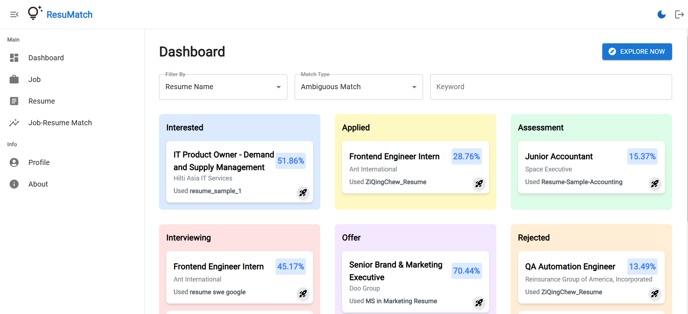
Filtering job-resume card:
 - For string value: ambiguous match or exact match
 - For numerical value: greater than, equal or less than
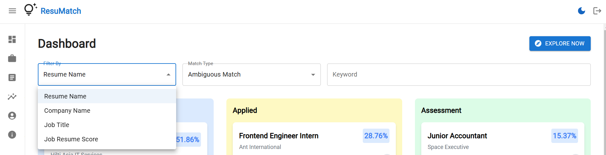
Job-resume card details
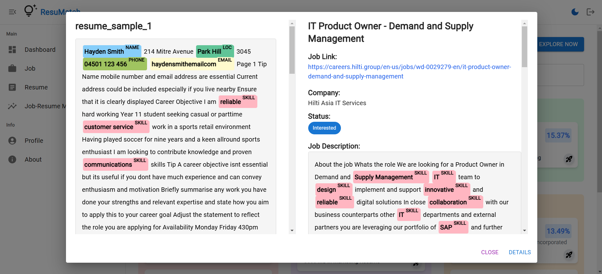
2. **Resume Management**
Resume preview
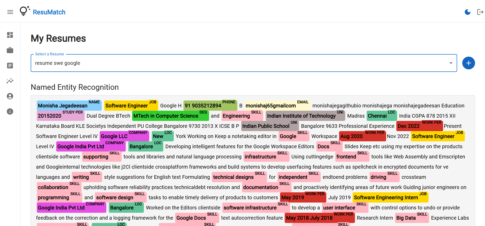
Upload resume
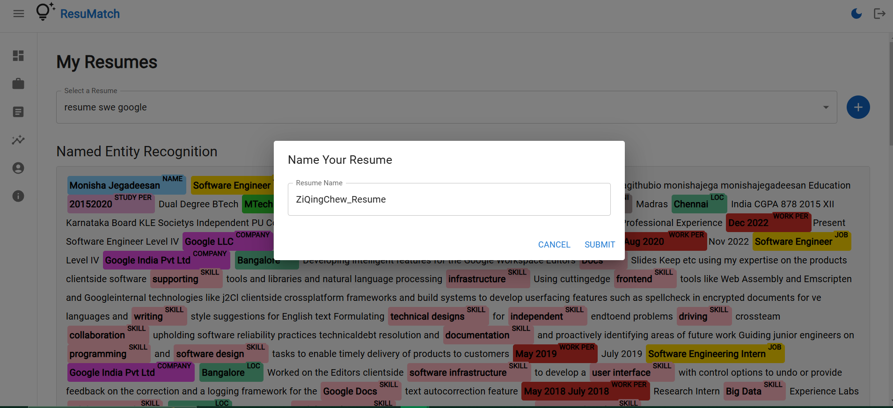
3. **Job Management**
Preview Mode
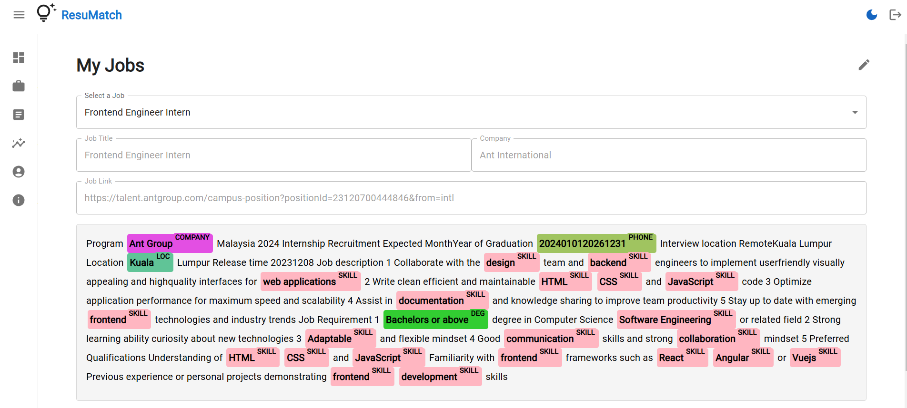
Edit Mode
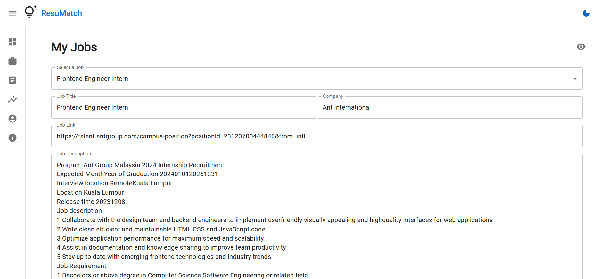
4. **Job-Resume Matching**
Select a resume, add new job/select uploaded job and update job application status
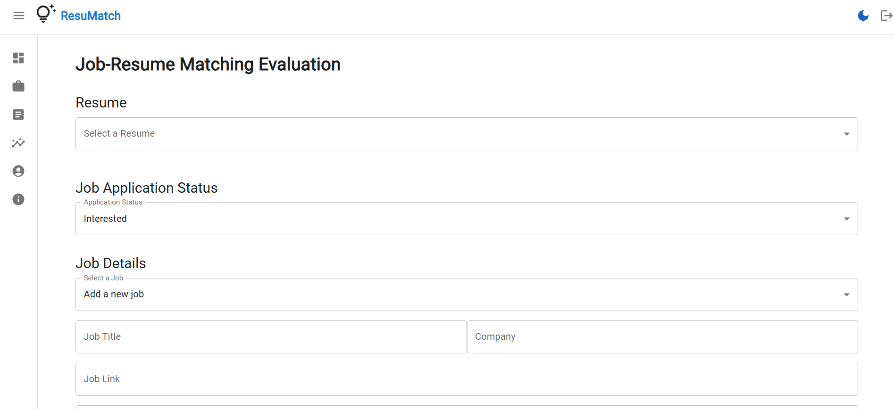
Job-resume matching evaluation details page
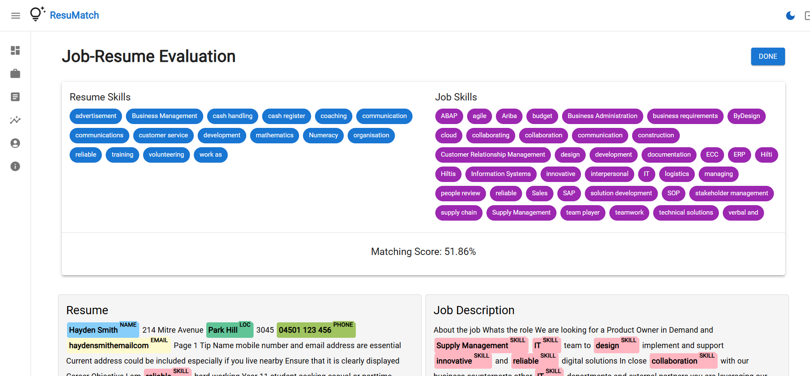
5. **Profile**
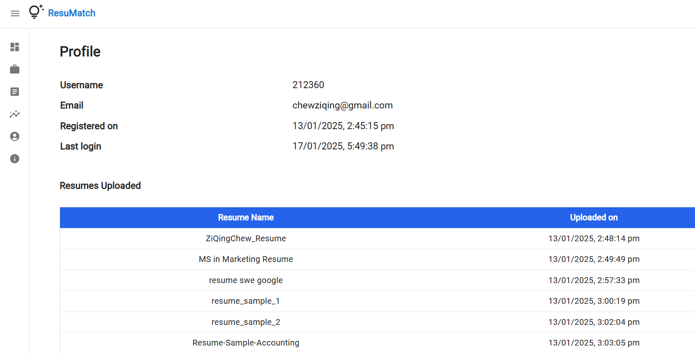
6. **Authentication**
Login
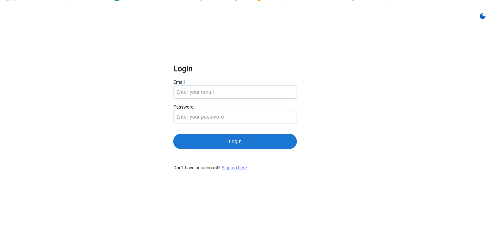
Signup
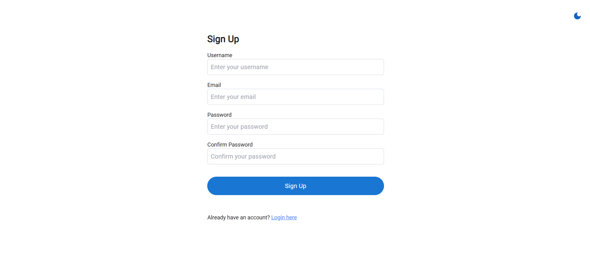
Logout
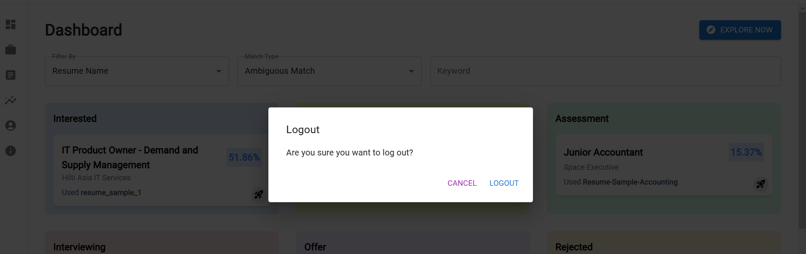
